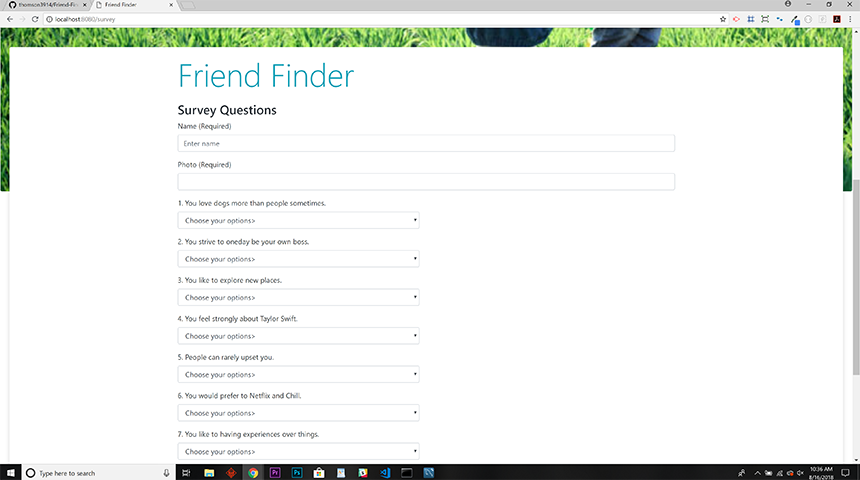
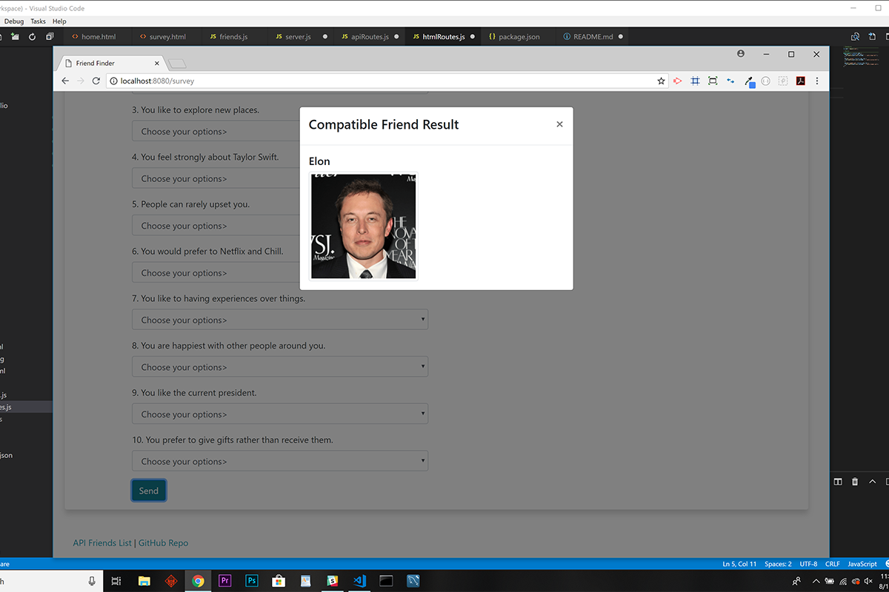

# Friend-Finder
Node and Express Servers - A Full-Stack Friend Matching App

### Check it Out!  
https://murmuring-wave-95722.herokuapp.com/

### :computer: Technologies Used 
 
 * Node.js
 * Command Line Interface
 * JavaScript
 * Node Modules
	* body-parser
	* express
	* path
 * Heroku

### :boom: Features

* A compatibility-based "FriendFinder" application (basically a dating app).  
* This full-stack site will take in results from the users' survey, 
* then compares their answers with those from other users. 
* The closest match will be the friend with the least amount of difference.
* Once the most compatible friend is found, their name and picture is displayed in the modal pop-up!

### Friend-Finder ScreensShots
Home.html

Survey.html

Best Overall Match

