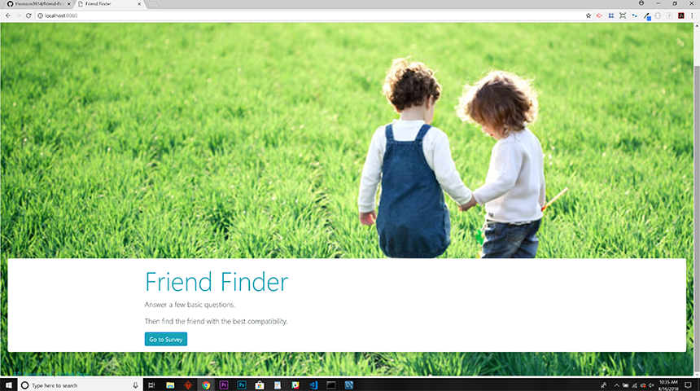
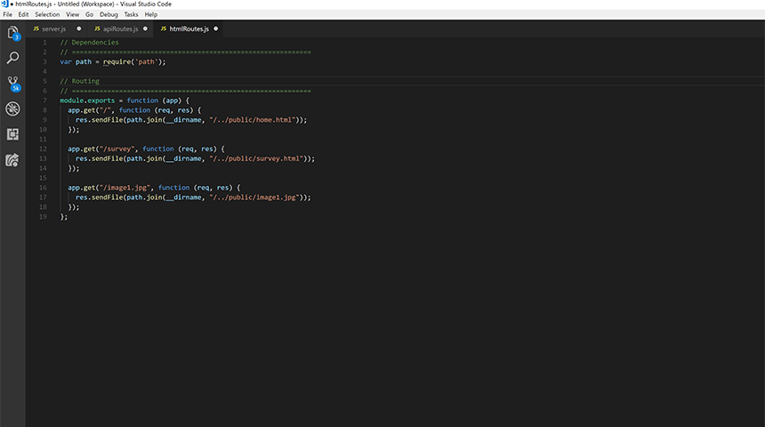

# Friend-Finder
Node and Express Servers - A Full-Stack Friend Matching App

### Link to Website 

### :computer: Technologies Used 
 
* Node.js
* JavaScript
* Node Modules
	* body-parser
	* express
	* path
* Heroku

### :boom: Features

A compatibility-based "FriendFinder" application -- basically a dating app. This full-stack site will take in results from the users' surveys, then compare their answers with those from other users. The app will then display the name and picture of the user with the best overall match.

### Friend-Finder ScreensShots
Home.html

Survey.html

Server.js

ApiRoutes.js

HtmlRoutes.js

Best Overall Match

